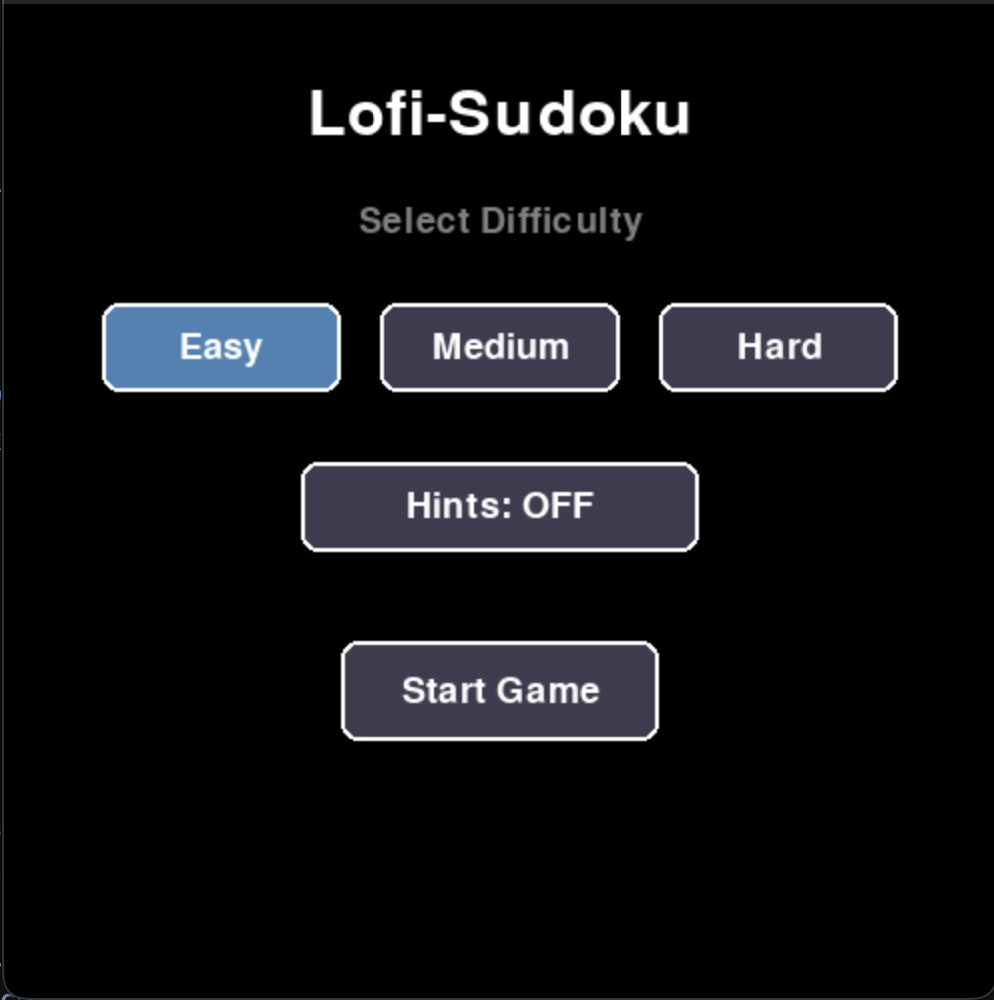
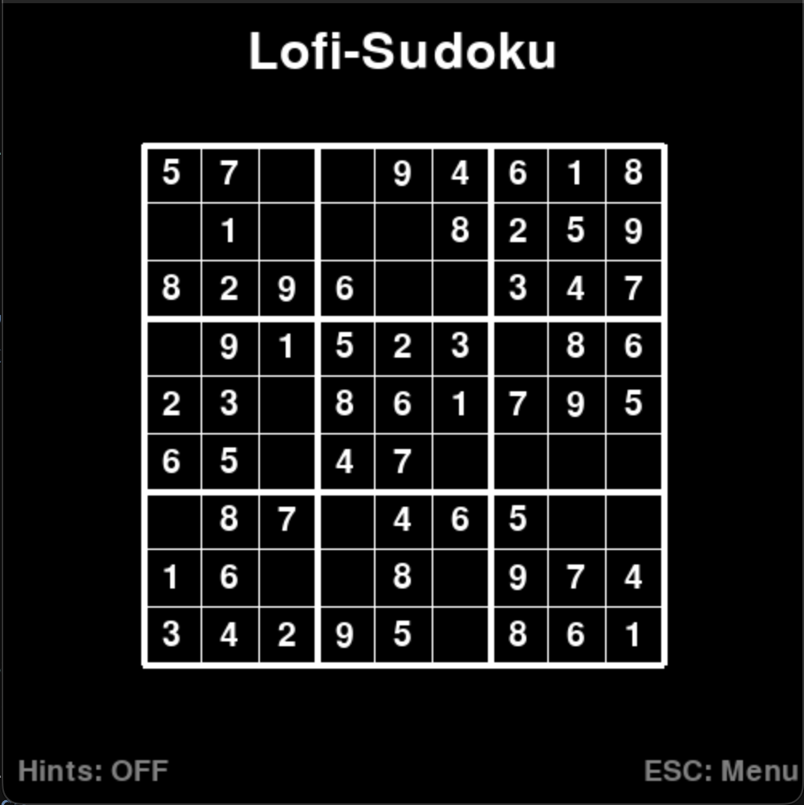
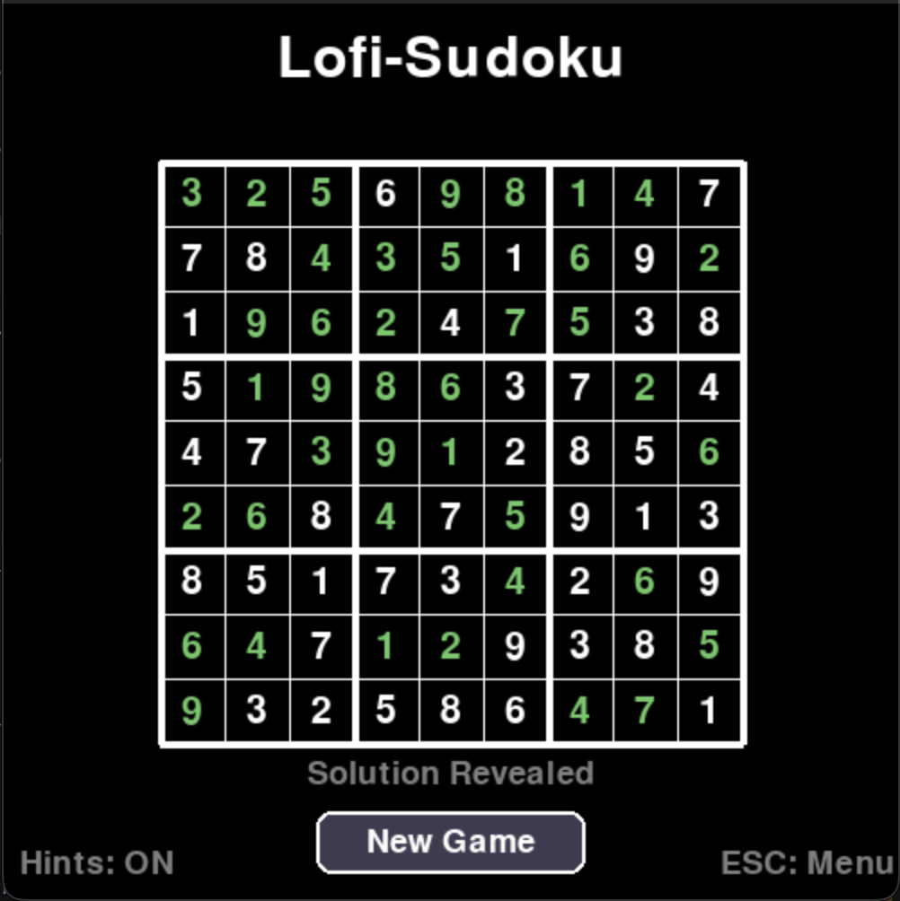
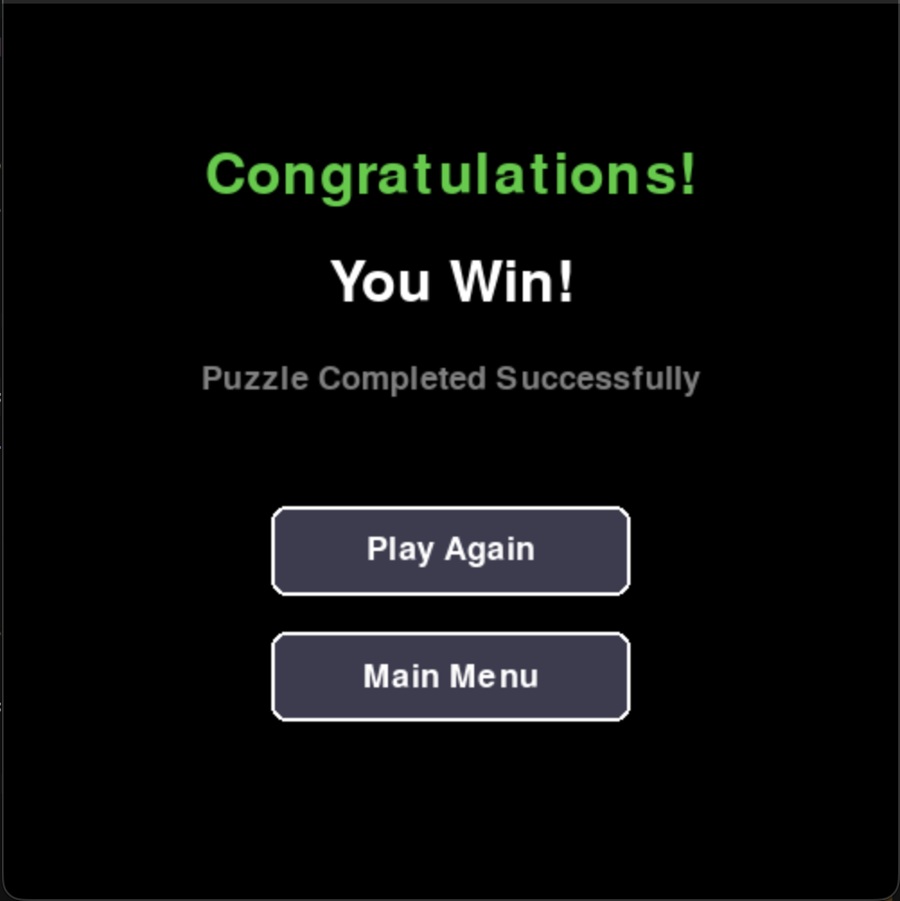

# 🧩 Lofi-Sudoku

A classic Sudoku puzzle game built with Python and Pygame — a personal learning project for [Boot.dev](https://boot.dev).


## 📖 About

This project is an implementation of the classic Sudoku number puzzle using Pygame. It's designed as a hands-on learning experience to explore game development concepts including rendering, user input handling, and game state management.

## 📸 Screenshots

<table>
  <tr>
    <td align="center" width="50%">
      
      <br><b>Start Screen</b><br>
      <em>Select difficulty and toggle hints</em>
    </td>
    <td align="center" width="50%">
      
      <br><b>Gameplay</b><br>
      <em>Click cells and enter numbers</em>
    </td>
  </tr>
  <tr>
    <td align="center" width="50%">
      
      <br><b>Solution View</b><br>
      <em>Reveal the answer when stuck</em>
    </td>
    <td align="center" width="50%">
      
      <br><b>Victory!</b><br>
      <em>Celebrate your success</em>
    </td>
  </tr>
</table>

## ✨ Features

- 🎮 **Standard 9×9 Sudoku grid** with 3×3 sub-box highlighting
- 🎚️ **Three difficulty levels** — Easy, Medium, and Hard
- 🖱️ **Click-to-select** cell input with keyboard number entry
- 💡 **Optional hints** — Color-coded feedback (green = correct, red = incorrect)
- 🏆 **Win detection** — Congratulations screen when you solve the puzzle
- 👁️ **Show Solution** — Reveal the answer if you're stuck
- 🔄 **Play Again** — Quick restart with same or new settings
- ⌨️ **Keyboard shortcuts** — ESC to return to menu, Delete/Backspace to clear cells

## 🚀 Getting Started

### Prerequisites

- Python 3.13+
- [UV](https://github.com/astral-sh/uv) package manager

### Installation

1. Clone the repository:

```bash
git clone https://github.com/yourusername/sudoku.git
cd sudoku
```

2. Install dependencies with UV:

```bash
uv sync
```

### Running the Game

```bash
uv run main.py
```

## 🎮 How to Play

Sudoku is a logic-based number puzzle. The objective is to fill a 9×9 grid so that:
- Each **row** contains the digits 1-9 with no repetition
- Each **column** contains the digits 1-9 with no repetition  
- Each of the nine 3×3 **sub-boxes** contains the digits 1-9 with no repetition

### Controls

| Action | Input |
|--------|-------|
| Select cell | Left-click on an empty cell |
| Enter number | Press 1-9 (keyboard or numpad) |
| Clear cell | Delete, Backspace, or 0 |
| Return to menu | ESC |

## 🛠️ Tech Stack

| Technology | Purpose |
|------------|---------|
| Python 3.13 | Core language |
| Pygame 2.6.1 | Game framework & rendering |
| py-sudoku | Puzzle generation |
| UV | Package management |

## 📁 Project Structure

```
sudoku/
├── main.py              # Game entry point, UI, and main loop
├── generate_puzzle.py   # Puzzle generation using py-sudoku
├── constants.py         # Colors, dimensions, and game settings
├── images/              # Screenshot assets
├── pyproject.toml       # Project configuration and dependencies
└── README.md            # You are here!
```

## 🗺️ Roadmap

- [x] Basic grid rendering
- [x] Puzzle generation system
- [x] User input handling (click + keyboard)
- [x] Real-time validation with color hints
- [x] Win condition detection
- [x] Difficulty selection screen
- [x] Show solution feature
- [x] Play again / new game flow
- [ ] Timer and score tracking
- [ ] Sound effects and music
- [ ] Save/load game progress
- [ ] Custom themes and backgrounds

## 📝 License

This project is open source and available under the [MIT License](LICENSE).

## 🙏 Acknowledgments

- Built as a learning project for [Boot.dev](https://boot.dev)
- Powered by [Pygame](https://www.pygame.org/)
- Puzzle generation by [py-sudoku](https://pypi.org/project/py-sudoku/)

---

*Last Updated: January 16, 2026*
